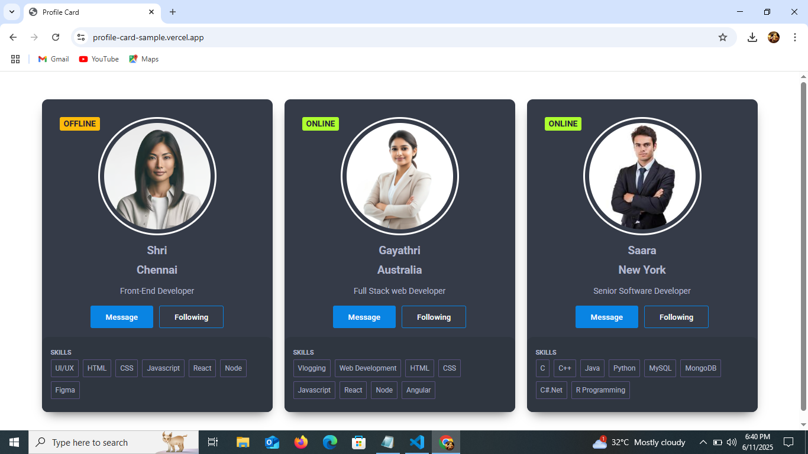
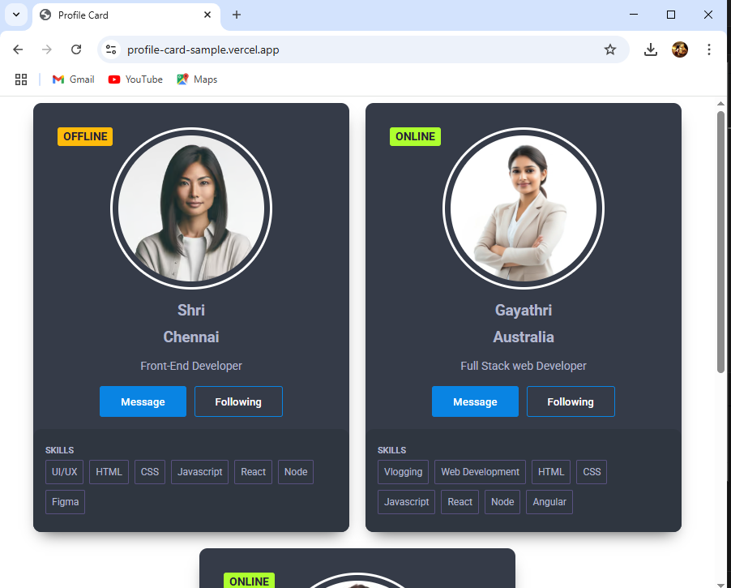
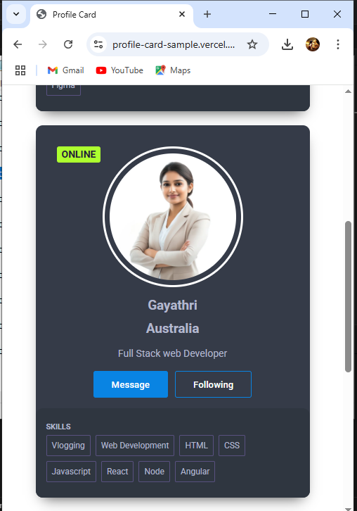

# React User Card 

A responsive user card interface built using **React**. This app showcases multiple user profiles with key details like name, location, description, skills, and online status.

## 🔗 Live Demo

[Click here to view](https://profile-card-sample.vercel.app/)  


## Developed By  
**Gayathri G**  
GitHub: [@GAYATHRI1006](https://github.com/GAYATHRI1006)

## Screenshot








## Features

- Displays multiple user cards with details  
- Shows dynamic online/offline badge  
- Skills displayed as a list  
- Buttons for UI interaction  
- Uses `props` and dynamic rendering via `map`  
- Clean and attractive card layout

## Getting Started

### 1. Clone the Repository

```bash
git clone https://github.com/GAYATHRI1006/Profile_Card.git
```

### 2. Install Dependencies

```bash
npm install
```

### 3. Run the App

```bash
npm run dev
```

## Tech Stack

- **React**
- **JavaScript**
- **HTML5**
- **CSS3**          

